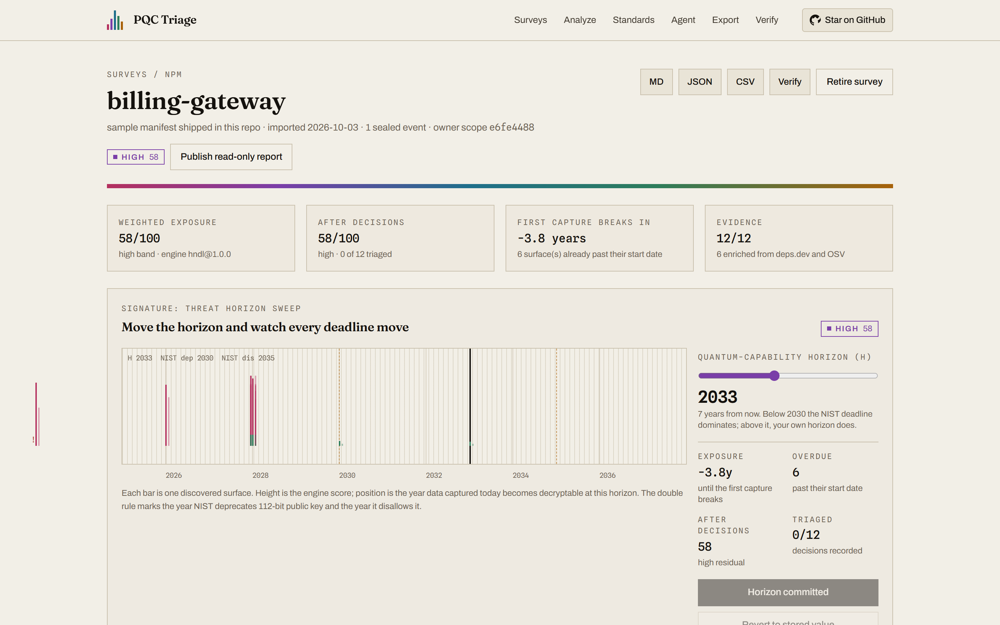
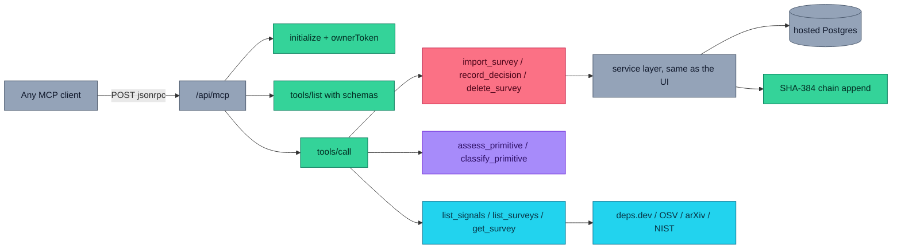
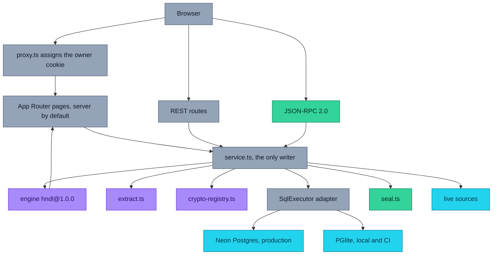
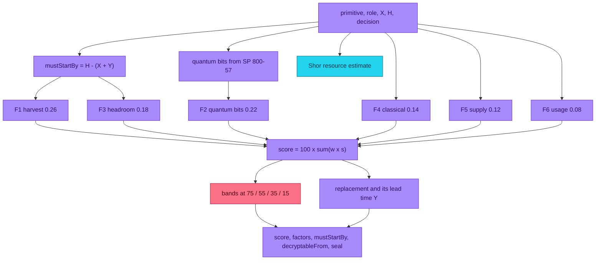
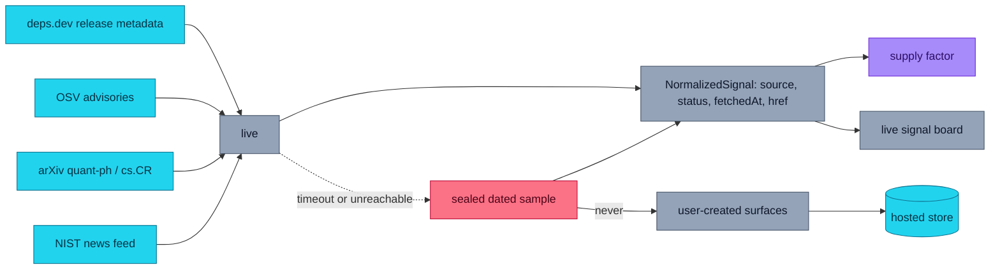
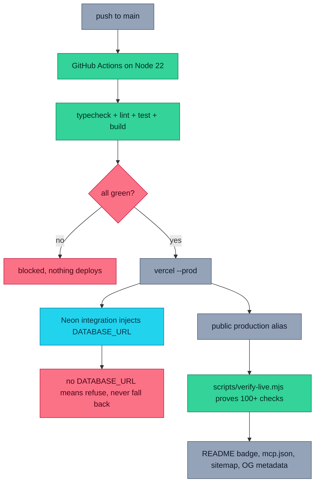
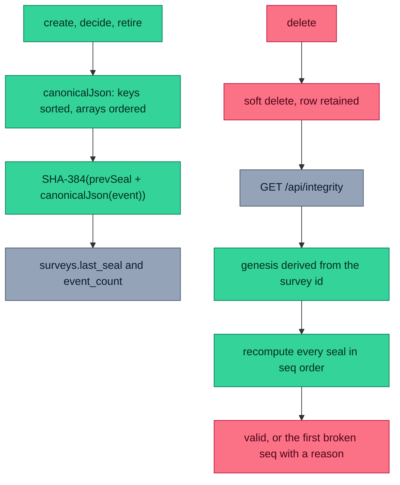
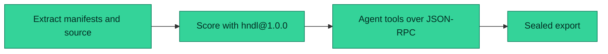
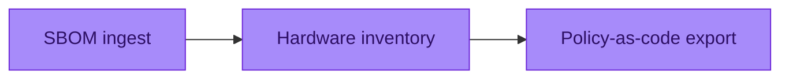

# PQC Triage

### Find the cryptography a quantum computer breaks first — and the exact year you must migrate by.

[](https://pqc-triage.vercel.app)
[](https://nextjs.org)
[](https://www.typescriptlang.org)
[](LICENSE)
[](#data-provenance)
[](#-agent-console)
[](src/lib/engine.ts)
[](#integrity-and-seal-replay)

**[Live app](https://pqc-triage.vercel.app)** · **[GitHub](https://github.com/aniruddhaadak80/pqc-triage)** · **[API](https://pqc-triage.vercel.app/api/health)** · **[Agent](https://pqc-triage.vercel.app/agent)** · **[Issues](https://github.com/aniruddhaadak80/pqc-triage/issues)**

Post-quantum migration is a calendar problem wearing a technical costume. Nobody argues
about whether RSA-2048 falls to Shor's algorithm; everybody argues about **when**, and the
honest answer is "whatever year a cryptographically relevant quantum computer arrives".
Most inventories never get that far, because the first hard question is *where the
cryptography is*.

PQC Triage imports a real dependency manifest and a real source excerpt, resolves every
cryptographic surface to an algorithm, scores each one against published quantum resource
estimates and the NIST transition dates, and commits a sealed migration plan with a
start-by year for every surface.

Zero API keys. Runs offline on an embedded Postgres. Every number carries its citation.



---

## ✨ Features

- **Real inventory.** Parses `package-lock.json`, `package.json`, `requirements.txt`,
  `go.mod`, `Gemfile.lock`, `composer.lock`, `Cargo.lock` and `pom.xml`, then scans a
  source excerpt line by line for cryptographic call sites. Every surface carries the line
  it matched on.
- **A deadline, not a score.** Mosca's rule: work must start by **H − (X + Y)** — the
  quantum horizon, minus the years the data must stay secret, minus the migration lead
  time. You get a year, not a percentage.
- **Explainable by construction.** Six weighted factors per surface, each with its weight,
  its severity, its point contribution and the sentence that produced it.
- **Published quantum costs.** Logical qubits and Toffoli counts for a Shor attack from
  the Gidney–Ekerå closed form for RSA, and the Häner et al. anchor scaled linearly for
  elliptic-curve discrete logs. Labelled as literature estimates, not predictions.
- **Honest live data.** deps.dev release metadata, OSV advisories, arXiv preprints and the
  NIST news feed, each reporting `live` or `fallback` with a sealed dated sample that is
  never presented as current.
- **An agent interface that cannot cheat.** MCP JSON-RPC 2.0 with ten typed tools. The
  mutating tools call the same service functions the buttons do, scoped to one owner, with
  idempotency keys.
- **An audit chain you can replay.** Every create, decision and retire appends a SHA-384
  seal: `seal_n = SHA-384(UTF-8(prevSeal) || canonicalJson(event_n))`. Deletes leave
  tombstones so the chain never breaks.
- **An in-repo model, no API key.** A multinomial Naive Bayes classifier trains from a seed
  corpus of realistic call sites plus every correction you teach it, and shows you the
  tokens that moved its answer.
- **A takeaway artifact.** Markdown, JSON or CSV migration plan with every factor, every
  citation, the provenance table and the seals. Plus a revocable public report link.

---

## 🚀 Quickstart

```bash
git clone https://github.com/aniruddhaadak80/pqc-triage
cd pqc-triage
npm ci
npm run dev
```

Open <http://localhost:3000>. **No environment variables are required.** Local development,
`npm test` and the browser suite all use an embedded PGlite Postgres at `.pgdata/`, which is
a real Postgres compiled to WebAssembly — the same schema, the same SQL, the same indexes.

A first-time visitor is seeded with one survey imported from the sample manifest that ships
in the repository, so the workbench has something real in it immediately.

### Quality commands

```bash
npm run typecheck    # tsc --noEmit, strict
npm run lint         # eslint, zero warnings tolerated
npm run test         # vitest, 125 deterministic unit tests
npm run build        # next build
npm run test:browser # Playwright: the full journey on desktop and mobile (needs a build first)
npm run verify:live  # end-to-end proof against a deployment
```

### Production environment variables

Documented in [`.env.example`](.env.example); all of them optional.

| Variable | Required | What it does |
| --- | --- | --- |
| `DATABASE_URL` | in production | Pooled Postgres connection string. Injected automatically by the Neon integration on Vercel. |
| `NEXT_PUBLIC_SITE_URL` | no | Overrides the public base URL used for canonical URLs, the sitemap, OpenGraph metadata and `mcp.json`. |
| `PGLITE_DATA_DIR` | no | Where the embedded database lives during local development. Defaults to `.pgdata`. |

On a Vercel runtime without `DATABASE_URL` the app **refuses to open a connection** rather
than quietly falling back to an ephemeral store. See `assertStoreUsable` in
[`src/lib/db/client.ts`](src/lib/db/client.ts).

---

## 🔌 API

Everything is owned by an anonymous HttpOnly session cookie, so there is no account to
create. The first response from the edge proxy sets `pqc_sid`.

```bash
BASE=https://pqc-triage.vercel.app

# Health: proves the store with a real insert, read-back and delete
curl -s $BASE/api/health | jq '.store, .writeProbe, .engineVersion'

# Create a survey from a manifest and a source excerpt
SURVEY=$(curl -s -c jar -X POST $BASE/api/surveys \
  -H 'content-type: application/json' \
  -d '{"name":"billing-gateway","repoHint":"acme/gateway",
       "manifest":"{\"dependencies\":{\"jsonwebtoken\":\"^9.0.2\",\"node-forge\":\"^1.3.1\"}}",
       "source":"jwt.sign(p, s, { algorithm: \"HS256\" });\nconst legacy = crypto.createCipheriv(\"des-ede3\", key, iv);"}' \
  | jq -r '.survey.id')

# Read it back, with the analysis the UI renders
curl -s -b jar $BASE/api/surveys/$SURVEY | jq '.analysis.score, .analysis.band, .analysis.engineVersion'

# Decide on the worst surface
SURFACE=$(curl -s -b jar $BASE/api/surveys/$SURVEY | jq -r '.analysis.surfaces[0].surfaceId')
curl -s -b jar -X PATCH $BASE/api/surfaces/$SURFACE \
  -H 'content-type: application/json' \
  -d '{"decision":"migrate-now","decisionNote":"Hybrid KEM in the next release.","shelfLifeYears":27}'

# Read the persisted state back
curl -s -b jar $BASE/api/surveys/$SURVEY \
  | jq --arg s "$SURFACE" '.surfaces[] | select(.id==$s) | {decision, shelfLifeYears}'

# Run the engine over any primitive, with nothing stored
curl -s -X POST $BASE/api/mcp -H 'content-type: application/json' \
  -d '{"jsonrpc":"2.0","id":1,"method":"tools/call",
       "params":{"name":"assess_primitive","arguments":{"primitive":"rsa-2048","shelfLifeYears":25}}}'

# Replay the seal chain
curl -s -b jar "$BASE/api/integrity?survey=$SURVEY" | jq '.valid, .eventsChecked, .algorithm'

# Download the plan
curl -s -b jar -D- -o plan.md "$BASE/api/export?survey=$SURVEY&format=md"

# Retire it; the rows stay as tombstones and replay still verifies
curl -s -b jar -X DELETE $BASE/api/surveys/$SURVEY | jq '.tombstone, .seal'
```

### Errors

One envelope for every endpoint and every tool call.

```json
{ "error": { "code": "validation_error", "message": "The request body did not match the schema.", "details": [{ "path": "name", "message": "Too small: expected string to have >=1 characters" }] } }
```

| Code | Status | When |
| --- | --- | --- |
| `validation_error` | 422 | Schema or bounds failure |
| `not_found` | 404 | Missing, or owned by another session |
| `conflict` | 409 | State conflict |
| `rate_limited` | 429 | Best-effort write limiter tripped |
| `unsupported_media_type` | 415 | Wrong content type |
| `internal_error` | 500 | Anything unexpected, with no stack trace and no environment values |

---

## 🤖 Agent console

Ten typed tools over MCP-style JSON-RPC 2.0 at `/api/mcp`. The mutating tools call the
same service functions the buttons on the site call.

```json
{
  "mcpServers": {
    "pqc-triage": {
      "type": "http",
      "url": "https://pqc-triage.vercel.app/api/mcp"
    }
  }
}
```

The same configuration is served from
[`public/mcp.json`](https://pqc-triage.vercel.app/mcp.json).



An agent that does not keep cookies takes the `ownerToken` from the `initialize` result
and sends it back as `params.ownerToken`; it is an unguessable 128-bit capability scoped to
that owner. Mutating tools accept an `idempotencyKey`; replaying the same key returns the
first result instead of writing twice.

---

## Architecture



Server components are the default; client components exist only where there is
interaction. The engine, the registry, the resource model and the classifier are pure
TypeScript with no Node dependencies, which is why the browser can run the identical
function the server does — the sweep on the workbench is not an approximation of the
score, it is the score.

```mermaid
flowchart LR
  classDef data fill:#22d3ee,stroke:#0e7490,color:#083344
  classDef engine fill:#a78bfa,stroke:#6d28d9,color:#2e1065
  classDef agent fill:#34d399,stroke:#047857,color:#022c22
  classDef infra fill:#94a3b8,stroke:#475569,color:#0f172a
  classDef risk fill:#fb7185,stroke:#be123c,color:#4c0519
  Manifest["manifest paste"]:::data --> Detect["detectEcosystem"]:::engine
  Source["source excerpt"]:::data --> Scan["scanSource, line by line"]:::engine
  Detect --> Parse["parseManifest per ecosystem"]:::engine
  Parse --> Pkg["match the curated crypto package list"]:::engine
  Scan --> Hits["one hit per primitive, with line numbers"]:::engine
  Pkg --> Row["ExtractedSurface"]:::engine
  Hits --> Row
  Row --> Resolve["resolvePrimitive into the scoring table"]:::engine
  Resolve --> Enrich["enrich up to six dependencies"]:::data
  Enrich --> Persist["surfaces and surveys rows"]:::infra
  Persist --> Score["analyzeSurvey"]:::engine
  Score --> Bands["band and deadline per surface"]:::engine
  Bands --> Band["no live signal scores neutral, never zero"]:::risk
```





## Data provenance



| Source | Used for | Endpoint |
| --- | --- | --- |
| [deps.dev](https://deps.dev) | Latest release, publish date, license per dependency | `api.deps.dev/v3alpha` |
| [OSV](https://osv.dev) | Published advisory records per dependency | `api.osv.dev/v1/query` |
| [arXiv](https://arxiv.org) | Current quant-ph / cs.CR work on post-quantum migration | `export.arxiv.org/api/query` |
| [NIST news](https://www.nist.gov/news-events/news) | Standards announcements, filtered for cryptography | `www.nist.gov/news-events/news/rss.xml` |
| [NIST IR 8547](https://csrc.nist.gov/pubs/ir/8547/ipd) | Transition dates: deprecate after 2030, disallow after 2035 | cited, not fetched |
| [NIST SP 800-57](https://csrc.nist.gov/pubs/sp/800/57/pt1/r5/final) | Comparable strengths; Grover halves symmetric strength | cited, not fetched |
| [Gidney & Ekerå 2021](https://quantum-journal.org/papers/q-2021-04-15-433) | RSA Shor cost: 6,189 logical qubits at n=2048 | cited, not fetched |
| [Häner et al. 2020](https://eprint.iacr.org/2020/1193) | ECDLP anchor: 2,124 logical qubits at 256 bits | cited, not fetched |
| [FIPS 203](https://csrc.nist.gov/pubs/fips/203/final) / [204](https://csrc.nist.gov/pubs/fips/204/final) / [205](https://csrc.nist.gov/pubs/fips/205/final) | ML-KEM, ML-DSA and SLH-DSA parameter sets | cited, not fetched |

Each live response reports `live` or `fallback` per source, with the fetch time. When a
feed is unreachable the app serves a **sealed dated sample** and says so, including the
sample's own date. Fallback data never replaces user-created data, and a dependency with no
live signal is scored **neutral**, never as if it were clean.

## Deployment



`DATABASE_URL` is injected by the Neon integration on Vercel. Both Postgres drivers are
declared in `serverExternalPackages`, because PGlite's WASM binary and seed data must stay
outside the server bundle. `scripts/verify-live.mjs` runs the whole loop against the public
alias with real HTTP and fails loudly if the store is not the hosted one.

## 📁 Project map

### User routes

| Route | What it is for | Persistence |
| --- | --- | --- |
| `/` | Product entry: live posture plate, the import form, current research | Reads the owner's newest survey |
| `/surveys` | Workspace. Filter by band and sort in the URL | Reads the owner's surveys |
| `/surveys/new` | The primary action: manifest plus source excerpt | `POST /api/surveys` |
| `/surveys/[id]` | The workbench: fringe plate, horizon sweep, per-surface triage | `PATCH` and `POST` on surfaces |
| `/surveys/[id]?panel=integrity` | Seal replay with the full event list | Reads the audit chain |
| `/analyze` | Cross-survey what-if across five horizons, with bulk commit | `PATCH` per survey when committed |
| `/standards` | Scoring table, resource model, engine factors, the classifier | `POST` and `PUT` on `/api/classify` |
| `/agent` | Live JSON-RPC 2.0 console with preloaded calls and a full-loop button | Whatever the called tool writes |
| `/export` | Export centre with a rendered preview | Reads, and `GET /api/export` downloads |
| `/verify` | Replay every chain in the session | `GET /api/integrity` |
| `/share/[id]` | Public read-only report, only when the owner published it | None. Revocable |

### API routes

| Route | Methods | Responsibility |
| --- | --- | --- |
| `/api/health` | `GET` | Proves the store with a real write probe |
| `/api/live` | `GET` | Normalized signals with per-source status |
| `/api/surveys` | `GET`, `POST` | List and import |
| `/api/surveys/[id]` | `GET`, `PATCH`, `DELETE` | Read, rename / publish / horizon, retire |
| `/api/surveys/[id]/surfaces` | `GET`, `POST` | List and add a surface by hand |
| `/api/surfaces/[id]` | `GET`, `PATCH`, `DELETE` | Decide, retune the shelf life, retire |
| `/api/classify` | `GET`, `POST`, `PUT` | Classify, teach, and export the learned table |
| `/api/export` | `GET` | Markdown, JSON or CSV download |
| `/api/integrity` | `GET` | Seal replay, optionally with the event log |
| `/api/settings` | `GET`, `PUT` | Horizon and thresholds for the session |
| `/api/mcp` | `GET`, `POST` | JSON-RPC 2.0 and the tool manifest |

### Domain

| Path | Responsibility |
| --- | --- |
| `src/lib/crypto-registry.ts` | The scoring table: strength, quantum bits, NIST dates, replacement |
| `src/lib/engine.ts` | `hndl@1.0.0`: six weighted factors, Mosca deadline arithmetic, banding |
| `src/lib/resource.ts` | Shor resource estimates from the published models |
| `src/lib/extract.ts` | Manifest parsing per ecosystem, source scanning, package hints |
| `src/lib/classifier.ts` | `nbc@1.0.0` multinomial Naive Bayes, exportable weights |
| `src/lib/corpus.ts` | Seed training set of realistic call sites |
| `src/lib/canonical.ts` | Canonical JSON and SHA-256 |
| `src/lib/seal.ts` | Genesis, seal computation, chain replay |
| `src/lib/service.ts` | The only place state changes |
| `src/lib/db/` | `SqlExecutor` contract, Neon and PGlite adapters, additive migrations |
| `src/lib/live/` | The four public sources, timeouts, normalization, sealed fallback |
| `src/lib/export.ts` | Markdown, JSON and CSV builders |

---

## Security model and ownership

- **Anonymous ownership.** An edge proxy assigns a 128-bit random `HttpOnly` cookie before
  anything else runs and forwards the id on an internal header, so the very first page load
  already knows the owner. Every query filters on `session_id`. Another session reading your
  survey gets `404`, not `403`.
- **Destructive operations.** Retirement is a soft delete plus a sealed event. Rows stay as
  tombstones so replay never breaks; the public report link is revoked.
- **Abuse control.** A 60-writes-per-minute in-process limiter per session, payload caps on
  every text field, a 60-surface import cap, and an allowlisted egress set. The limiter is
  documented as **best-effort**: a serverless runtime can recycle the process at any moment,
  so a durable limiter belongs in a hosted rate limiter or an edge rule, not in this
  application. There is deliberately no control here that pretends otherwise.
- **Input.** Every body is validated with a Zod schema, every id is checked against a UUID
  pattern, every string is length-bounded, every SQL statement is parameterised, and no
  upstream payload reaches the UI unnormalized.
- **Secrets.** There are none to leak. No API keys, no tokens, no client-side environment
  reads. `.env.example` documents shape only.
- **Publishing is explicit and revocable.** `/share/[id]` returns `404` for anything the
  owner has not published.
- **Errors.** No stack traces and no environment values reach a client.

## Integrity and seal replay



Timestamps are stored as application-generated ISO-8601 text rather than database types,
which keeps the chain byte-identical across the hosted and embedded adapters. The unit
tests recompute every digest with Node's `crypto` directly, so the implementation and the
oracle would both have to change for the suite to pass.

## User journey


---

## 🗺️ Roadmap

### Now — shipped and verified



- Import a manifest and a source excerpt, and see every cryptographic surface with the line it matched.
- Move the quantum horizon and watch every must-migrate-by year recompute, then commit it.
- Record a decision and a rationale, and watch the residual score fall.
- Hand the plan to a reviewer as Markdown, JSON or CSV, and prove it with a seal replay.

### Next


- **Reachability:** score a surface by whether anything actually calls it, so a dormant RSA helper does not outrank the TLS terminator. Outcome: the worklist matches reality, not just the manifest.
- **Hybrid rollout checklist:** per surface, the concrete steps for a classical-plus-PQ handshake, including certificate size and MTU implications. Outcome: an engineer can start on Monday.
- **Saved plan versions:** snapshot a survey's analysis so a migration can be reviewed as a diff. Outcome: you can prove what changed between two reviews.
- **Signed share links:** HMAC the public report path so a link cannot be guessed or replayed after revocation.

### Later



- **SBOM ingest:** read CycloneDX and SPDX directly, so you do not have to paste a manifest.
- **Hardware inventory:** model HSM and KMS boundaries, which is where real key custody lives.
- **Policy-as-code export:** emit the plan in the format your compliance tooling already reads.

---

## 🤝 Contributing

Issues and pull requests are welcome. Please read [CONTRIBUTING.md](CONTRIBUTING.md) first,
and [SECURITY.md](SECURITY.md) before reporting anything security-related.

```bash
npm ci && npm run typecheck && npm run lint && npm run test && npm run build
```

## License

MIT © PQC Triage contributors. See [LICENSE](LICENSE).

> **Not security advice.** PQC Triage is an engineering aid. It does not certify a system
> as quantum-safe, it models a calendar rather than your threat model, and its resource
> figures are published literature values under stated assumptions, not forecasts. Do not
> paste production secrets: what you import is stored so it can be scored.